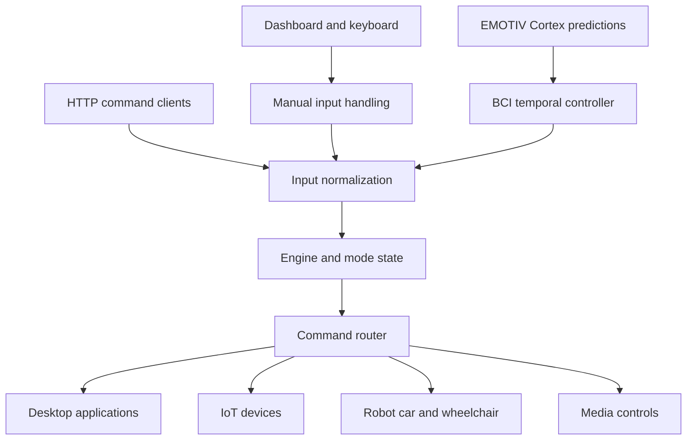

# MasterHub

**One control hub for desktop applications, IoT devices, mobility hardware, and BCI mental commands.**

MasterHub is a Python and Flask application that converts manual input or EMOTIV Cortex mental-command predictions into actions. You choose a domain, choose an application or device, and then issue commands through a browser dashboard. A state machine keeps track of the current menu so the same gesture can perform different actions in different contexts.

You can start with **manual controls on your own computer**. An EEG headset, MQTT broker, and external hardware are only needed for the features that use them.

## Contents

- [What you can control](#what-you-can-control)
- [Install and start](#install-and-start)
- [Your first command](#your-first-command)
- [Manual controls and timing](#manual-controls-and-timing)
- [BCI mental commands](#bci-mental-commands)
- [Connect external devices](#connect-external-devices)
- [API examples](#api-examples)
- [Project structure](#project-structure)
- [Testing and prediction replay](#testing-and-prediction-replay)
- [Troubleshooting](#troubleshooting)
- [Development and deployment notes](#development-and-deployment-notes)

## What you can control

- **Python / Desktop:** workflows for Chrome, YouTube, Notepad, and Gmail. Desktop automation acts on the selected computer and can require an open, signed-in browser session.
- **IoT Smart Home:** light, fan, and pump commands through MQTT-connected devices.
- **Embedded Mobility:** command routing for a robot car and wheelchair through configured MQTT topics.
- **AI/ML & Media:** media playback and audio controls, including JioSaavn workflows. This domain name does not mean every action uses an AI model.

Input options include dashboard buttons, arrow keys, HTTP requests, and a live EMOTIV Cortex `com` stream. MasterHub also includes a recorded-prediction replay client.



## Install and start

### 1 Get the project

Clone this repository using its **Code** button URL, or download and extract its ZIP. Open PowerShell inside the folder containing `app.py` and `requirements.txt`.

The commands below use **Windows PowerShell**. Local desktop workflows include Windows-specific applications and paths. Other operating systems need adaptation; full cross-platform support is not established.

You need Python with `pip` and a browser. The repository pins dependencies in `requirements.txt` but does not declare a supported Python version range. Use an interpreter for which those pinned packages are available.

### 2 Create an isolated Python environment

```powershell
python --version
python -m venv .venv
.\.venv\Scripts\python.exe -m pip install --upgrade pip
.\.venv\Scripts\python.exe -m pip install -r requirements.txt
```

These commands call the virtual environment directly, so PowerShell script activation is unnecessary. Continue using that same Python executable for subsequent commands.

For **USB serial support**, install the optional dependency that is not currently listed in `requirements.txt`:

```powershell
.\.venv\Scripts\python.exe -m pip install pyserial
```

### 3 Configure your local installation

Create a file named `.env` beside `app.py`. For a local manual-only start, use:

```dotenv
MQTT_HOST=127.0.0.1
MQTT_PORT=1883
```

This points MQTT at your own computer instead of the project-specific broker fallback. A broker is not required for the local Notepad walkthrough. If none is running, MQTT connection warnings are expected.

Previously saved hardware settings in `.runtime/hardware.json` override the MQTT environment defaults. If that file was copied with the project, review its host and topics before starting. See [Connect external devices](#connect-external-devices).

For Chrome-based actions, edit [config.py](config.py) to match your installation:

```python
CHROME_PATH = r"C:\Program Files\Google\Chrome\Application\chrome.exe"
CHROME_PROFILE = "Default"
```

The checked-in profile setting may refer to the original developer's profile. Choose one that exists on your computer. Keep the Windows desktop unlocked when using GUI automation.

### 4 Start MasterHub

For an initial local session, bind only to your computer:

```powershell
.\.venv\Scripts\python.exe -m flask --app app run --host 127.0.0.1 --port 5000
```

Open **[http://127.0.0.1:5000/dashboard](http://127.0.0.1:5000/dashboard)**.

Useful pages:

- `/dashboard` — main control console.
- `/cortex/` — headset setup and BCI monitoring, using the default Cortex URL prefix.
- `/api/health` — API health check.
- `/api/state` — current mode and state.
- `/api/commands` — recognized commands.
- `/` — JSON application information; it is not the dashboard.

The project also supports `.\.venv\Scripts\python.exe app.py`. That entry point attempts MQTT connection at startup and runs Flask with **debug enabled on `0.0.0.0:5000`**, exposing the listener on available network interfaces. Use it only in a trusted development environment. The localhost command above avoids that default network binding.

Press **Ctrl+C** in the server terminal to stop it. Stop connected actuators before shutting down the host.

## Your first command

Try this without a headset or external hardware:

1. Start the server and open `/dashboard`.
2. In the PC Agent Controller, select **Local Host** as the active target.
3. Choose **Python / Desktop**.
4. Choose **Notepad**.
5. Select the command to open Notepad.
6. Watch the pending command and temporal countdown. A command without input fields starts its countdown when selected. Let it finish, or use the displayed cancel control to abort.
7. Confirm that Notepad opens and check the activity feed for the result.

For commands with input fields, fill in the required values and submit using the command controls. Verify the active application and target before actions that type, save files, or send messages.

**Expected result:** the dashboard shows the selected workflow, records the command result, and the local application responds. An offline IoT or BCI indicator does not prevent a local desktop workflow from being used.

## Manual controls and timing

The dashboard follows **Domain → Device or Application → Command**. Prefer mouse controls while learning the menus; the available choices show what each action means in the current context.

### Arrow keys

- **Up** corresponds to `push`.
- **Down** corresponds to `pull`.
- **Left** corresponds to `left`.
- **Right** corresponds to `right`.

At the main menu, these select Desktop, Embedded Mobility, IoT, and AI/ML & Media respectively. At the next level they select the mapped device or application. At the command level they enter gestures. Arrow shortcuts are ignored while an input, textarea, or select field has focus.

Ordered combinations have their own meanings:

- `push+right` — Back.
- `push+left` — Main menu.
- `right+push` — Volume up in applicable media modes.
- `right+pull` — Volume down in applicable media modes.

**Order matters:** `push+right` and `right+push` are different commands. Consult the displayed choices and [gesture mappings](mappings/gesture_map.json) for the current mode.

### Temporal window

The default window is **4 seconds**; the configuration API accepts values from **2 to 10 seconds**. A window gives the system time to interpret a first gesture and a possible second gesture before acting.

The current input paths differ:

- **Dashboard action selection:** a resolved command waits through the preview countdown. The UI offers cancellation and Execute Now.
- **Manual command-level arrow gestures:** a single waits for the window; a second gesture or recognized key chord forms a pair and dispatches immediately.
- **Live BCI:** both singles and valid pairs wait until the original deadline. Capturing a second gesture does not restart the window.
- **Direct API requests:** `/api/command` does not automatically apply the framing delay.

Domain and device selection have their own immediate navigation branches. Do not assume every click or arrow press is delayed.

## BCI mental commands

### What you need

- An EMOTIV headset compatible with your Cortex installation.
- EMOTIV Launcher and the local Cortex service running on the same computer as MasterHub.
- Your own Cortex application credentials and the required account access for the selected device and stream.
- A trained mental-command profile for the intended user.

For current vendor setup and access requirements, refer to the [official Cortex documentation](https://emotiv.gitbook.io/cortex-api). MasterHub consumes classified mental commands; it does not train a raw EEG model for you.

### Add credentials

Add these entries to your local `.env`, replacing the placeholders:

```dotenv
CORTEX_CLIENT_ID=your_client_id
CORTEX_CLIENT_SECRET=your_client_secret
CORTEX_URL=wss://localhost:6868
CORTEX_STREAM_NAME=com
BCI_CONFIDENCE_THRESHOLD=0.20
# Optional if required by your account or features
CORTEX_LICENSE=
```

The BCI setup panel also supports saving credentials. Keep `.env` private; it is already listed in `.gitignore`. Restart MasterHub after changing environment-based settings such as the power threshold.

### Connect and operate

1. Start EMOTIV Launcher, sign in, and connect your headset.
2. Start MasterHub and open **Cortex Setup**, the **BCI** header pill, or `/cortex/`.
3. Save your credentials if needed, then choose **Connect Headset**. Approve application access in EMOTIV Launcher when prompted.
4. Select and load your trained profile.
5. Confirm that fresh predictions appear before choosing **Enable Control**.
6. Return to neutral to arm the next command.
7. Perform a trained gesture with sufficient detector power. It starts a temporal frame.
8. Add a mapped second gesture before the deadline for a combination, or let the single finish. Return to neutral before starting the next frame.
9. Use **Stop Control** to disable BCI actuation and cancel pending BCI framing.

Use the app's Connect button for live control. `run_cortex.py` is a separate diagnostic process and does not share control enablement with an already running MasterHub application.

### Current BCI behavior

- The source default threshold is `0.20`, subject to environment overrides. The value is detector **power**, not a calibrated percentage of intention accuracy.
- One neutral sample rearms the current implementation, and one qualifying active sample can start the frame. There is no additional mandatory active hold or neutral dwell in `CortexControl`.
- Repeated packets of a held gesture do not create repeated commands.
- A distinct second gesture forms a pair only if it is assigned in the current mode. An unassigned qualifying pair cancels the frame.
- Neutral between the first and second gestures is optional. **Neutral does not cancel a pending nonmotion command.**
- Expiry is checked when the next prediction is processed, so dispatch can occur slightly after the displayed countdown reaches zero.
- Motion requires a matching active direction at dispatch; neutral requests a stop after motion starts.

Older guides contain different hold durations and navigation descriptions. For current behavior, use this README, [cortex/control.py](cortex/control.py), and [mappings/gesture_map.json](mappings/gesture_map.json).

## Connect external devices

### MQTT devices

MasterHub is an MQTT **client**; it does not start a broker or install device firmware. You need a reachable broker and a compatible device that subscribes to commands and publishes the expected status and acknowledgement messages.

Configure your own broker and mobility device IDs:

```dotenv
MQTT_HOST=127.0.0.1
MQTT_PORT=1883
ROBOT_CAR_TOPIC=robotcar/YOUR_CAR_ID/control
WHEELCHAIR_TOPIC=wheelchair/YOUR_CHAIR_ID/control
```

The host must be reachable from both MasterHub and your devices. `127.0.0.1` works only for a broker on the same machine from the client's perspective; a separate device usually needs the broker computer's LAN address.

Hardware settings can be read or saved through `/api/hardware/config` and connected through `/api/hardware/connect`. Saved settings live in `.runtime/hardware.json` and take precedence over the environment defaults.

The default IoT action topic is `iot/esp32/action`. Mobility uses the configured `robotcar/DEVICE_ID/control` and `wheelchair/DEVICE_ID/control` topics. See [services/mqtt_service.py](services/mqtt_service.py) and the relevant domain handler for exact messages. A broker connection alone does not mean a device is ready: check its heartbeat, topic identity, and acknowledgement.

### Remote PC agents

**Local Host** executes desktop actions on the MasterHub computer. A remote target requires a compatible agent running on that other computer; registering a target in the dashboard does not install or start the agent.

Use **Register Target PC Agent**, enter the device ID used by that agent, choose the transport, and wait for it to become online. Then select it as the active target. Agent setup and protocol compatibility must be completed separately; an offline placeholder such as `PC_001` is not a connected machine.

### USB serial

Install `pyserial`, connect the device, open the UART configuration dialog, and select the correct COM port. The service defaults to **115200 baud**. The receiving firmware or agent must implement the JSON-line envelope protocol expected by [services/usb_service.py](services/usb_service.py).

### Simulation and stopping

The sidebar **Simulation Mode** toggle currently changes UI state and logs; it is **not an execution sandbox**. Recorded prediction replay also sends real API requests. Do not rely on either to prevent hardware actions.

The software E-Stop sends stop requests, but its display is not proof that a physical device stopped. Mobility hardware needs its own independent stop and watchdog. Begin hardware testing with movement disabled and verify device acknowledgements before operating actuators.

## API examples

Run these in a second PowerShell terminal while the server is running.

Read health and available commands:

```powershell
Invoke-RestMethod http://127.0.0.1:5000/api/health
Invoke-RestMethod http://127.0.0.1:5000/api/commands
```

Return the application to its main menu:

```powershell
$body = @{ command = 'mode_idle' } | ConvertTo-Json
Invoke-RestMethod -Method Post -Uri http://127.0.0.1:5000/api/command -ContentType 'application/json' -Body $body
```

Select the desktop domain through a gesture from that main menu:

```powershell
$body = @{ gesture = 'push' } | ConvertTo-Json
Invoke-RestMethod -Method Post -Uri http://127.0.0.1:5000/api/command -ContentType 'application/json' -Body $body
```

Set the temporal window used by the framing paths:

```powershell
$body = @{ temporal_window = 4.0 } | ConvertTo-Json
Invoke-RestMethod -Method Post -Uri http://127.0.0.1:5000/api/config/temporal-window -ContentType 'application/json' -Body $body
```

These API calls bypass the browser countdown. Gesture meaning depends on the current mode. Inspect `/api/state` and `/api/workflow` before building your own client.

Other useful read endpoints include `/api/devices`, `/api/iot/status`, `/api/embedded/status`, `/api/usb/status`, `/api/metrics`, and `/api/activity-logs`.

## Project structure

```text
app.py                 Flask application and startup entry point
config.py              Local Chrome path and profile
api/                   HTTP endpoints
core/                  Input normalization, state machine, router, engine
actions/               Desktop, IoT, embedded, and media handlers
cortex/                EMOTIV connection, profiles, live stream, BCI framing
mappings/              JSON command, gesture, mode, and workflow definitions
services/              MQTT, USB, logging, validation, and workflow support
prediction_pipeline/   Prediction processing components
simulator/             Recorded-prediction HTTP replay client
templates/             Dashboard and BCI HTML
static/                Browser JavaScript and styling
tests/                 Unit tests and integration tooling
docs/                  Additional guides and technical reports
logs/                  Generated application and command logs
.runtime/              Saved local hardware configuration
requirements.txt       Pinned Python dependencies
```

To understand routing, start with [core/input_processor.py](core/input_processor.py), [core/engine.py](core/engine.py), and [core/router.py](core/router.py). To understand command timing, read [static/masterhub.js](static/masterhub.js) and [cortex/control.py](cortex/control.py).

## Testing and prediction replay

Install the test runner separately:

```powershell
.\.venv\Scripts\python.exe -m pip install pytest
```

A focused starting point is the BCI controller test module, which uses controlled predictions and isolated device handlers:

```powershell
.\.venv\Scripts\python.exe -m pytest tests/test_cortex_control.py -q
```

See [tests/README.md](tests/README.md) before running the integration tooling. Some tests and replay workflows interact with a running server or desktop applications; the whole test folder should not be assumed hardware-free.

For recorded input, inspect the replay options first:

```powershell
.\.venv\Scripts\python.exe -m simulator.replay --help
```

With a server running against an isolated test setup:

```powershell
.\.venv\Scripts\python.exe -m simulator.replay --file emotiv_bci_predictions.json --limit 10
```

Replay uses `/api/command` and can execute real mapped actions. Its confidence filter and cooldown path do not reproduce the live `CortexControl` temporal framing state machine. Use the controller tests to verify that timing behavior.

## Troubleshooting

**The browser shows JSON instead of the control panel.** Open `/dashboard`; `/` is an API information page.

**Python cannot import a package.** Install requirements with the same `.venv\Scripts\python.exe` used to start the app. If a pinned version cannot be resolved, record the Python version and failing package; this repository does not currently provide a cross-version dependency compatibility matrix.

**MQTT is disconnected.** Check the broker address, port, broker process, network reachability, and saved `.runtime/hardware.json`. For local-only desktop work, a disconnected broker is expected if you have not set one up.

**The broker is connected but a device is offline.** Check firmware topic names, the configured device ID, and status heartbeats. Check device acknowledgements instead of treating an HTTP success as proof of physical execution.

**Chrome or desktop automation fails.** Check `config.py`, the selected Local Host or remote target, application availability, browser sign-in, and desktop focus. GUI automation may depend on the visible application layout.

**No serial ports appear.** Install `pyserial`, verify the cable and device driver, and make sure another program is not holding the COM port.

**Cortex will not connect.** Confirm EMOTIV Launcher and its local service are running, check credentials and application approval, and inspect `/cortex/` for the connection error. MasterHub's HTTP port `5000` is separate from the default Cortex WebSocket port `6868`.

**Cortex reports session limit error `-32019`.** This means the license has no local quota for activating a session. MasterHub's live mental-command (`com`) and diagnostic (`dev`) streams use an `open` session, which does not need activation or a quota debit. Restart MasterHub after updating, then connect again. For a separate workflow that requires licensed activation (such as raw EEG or recording), check `getLicenseInfo` and replenish local quota using `authorize` with a positive `debit`, subject to the license's available sessions. See [EMOTIV session activation](https://emotiv.gitbook.io/cortex-api/session) and [error -32019](https://emotiv.gitbook.io/cortex-api/error-codes#id-32019).

**Predictions appear but commands do not run.** Load the correct profile, wait for fresh samples, enable control, return to neutral, and check power and the current mode's mapping. Save required action inputs before using those commands.

**A command runs after returning to neutral.** That is possible for a pending nonmotion BCI action. Neutral rearms control and stops active motion; use Stop Control to cancel pending BCI work.

**Older instructions disagree with the screen.** Some guides predate the current mappings and timing implementation. Check this README and the linked controller and mapping files.

The main application log is `logs/masterhub.log`. Cortex also writes under `cortex/logs/`; the dashboard exposes activity and BCI logs. Remove credentials and personal command content before sharing logs.

## Development and deployment notes

- This is a development project, not a production-secured remote control service. The shown API routes do not provide an authentication boundary; keep the server on localhost or a controlled network until access control and deployment hardening are added.
- Use a single application process for the current in-memory mode, device, and BCI control state. Multiple independent workers do not automatically share that state.
- The `eeg_window` API path currently uses a placeholder classifier in [services/eeg_service.py](services/eeg_service.py). It is not a trained raw EEG mental-command model.
- Remote agent software and device firmware must match the MasterHub protocol; their presence and compatibility are not guaranteed by this repository's dashboard.
- Before uploading your own copy, review `.env`, `.runtime/`, logs, recordings, and generated artifacts. `.env` is ignored, but not every runtime file or command recording is excluded by `.gitignore`.

### Add a command or device

1. Add its command-to-handler mapping in [mappings/command_map.json](mappings/command_map.json).
2. Implement or extend the appropriate handler under `actions/`.
3. Add any required mode and gesture mappings in [mappings/mode_map.json](mappings/mode_map.json) and [mappings/gesture_map.json](mappings/gesture_map.json).
4. Update [mappings/workflow_map.json](mappings/workflow_map.json) so the dashboard presents the device, command, and parameters.
5. Add focused tests for routing, required inputs, and any timing behavior. Restart the application so loaded mappings reflect the changes.

Additional background is available in [docs/](docs/) and the [Cortex module guide](cortex/README.md). Read older setup examples alongside the current source, especially for timing defaults and gesture meanings.

### Android JioSaavn companion

The separate Kotlin project is at `D:\GALATICX\BCI_remotecontroll_jiosaavn`.
Its debug APK is `app/build/outputs/apk/debug/app-debug.apk` within that project.
Install it on your phone, grant notification/media access and accessibility access,
open JioSaavn and start playback, then tap **Start remote control** in the companion.
Restart MasterHub and select **AI/ML & Media → Mobile JioSaavn**.

The mobile client uses its own broker connection; hardware MQTT settings are unchanged.
Optional settings are listed in [.env.mobile.example](.env.mobile.example).
See [the shared protocol and setup guide](docs/mqtt_protocol.md) for ACK semantics,
gesture mappings, private broker configuration, and the current search/launch limitations.
The dashboard phone panel shows live status, now-playing and correlated command results.
# SonarQube checks and deployment safety

The root `sonar-project.properties` excludes backup snapshots, bundled dependencies,
build outputs, and runtime artifacts. Maintain application fixes in the active
source tree, not archived copies or compiled vendor bundles. Scan exclusions do
not resolve vulnerabilities in shipped dependencies.

Install `tests/requirements.txt` alongside the application dependencies. Run the
offline security/dashboard regressions and generate actual coverage before scanning:

```powershell
python -m coverage run --source=app,api,core,services,cortex,actions -m pytest tests/test_web_security.py tests/test_modernization.py tests/test_cortex_control.py
python -m coverage xml
node --test tests/test_dashboard_security.cjs
sonar-scanner
```

Supply the SonarQube server URL and token through your scanner environment;
do not put tokens in the properties file. The commands above cover the selected
regression suites, not every application behavior. A successful test run does not
establish that the SonarQube Quality Gate passes; check a fresh server analysis.

Copy `.env.example` for local setup and keep actual credentials out of source
control. If credentials were previously committed, revoke/rotate them with the
provider and remove them from repository history through your normal repository
maintenance process. Ignoring `.env` does not remove a previously tracked file.

The application entry point disables Flask debug mode. Do not launch a deployed
instance with `flask --debug`. Browser mutations with foreign Origin/Referer or
cross-origin Fetch Metadata headers receive HTTP 403. Same-origin dashboard
requests and native clients without browser headers remain supported. This check
is not authentication; deploy the control API only behind appropriate access
controls. Reverse proxies must preserve the public request scheme and host.

