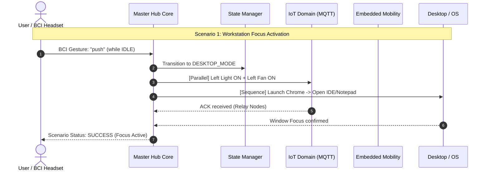
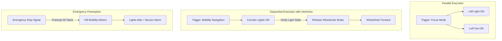

# Master Hub Smart Ecosystem Architecture & Scenario Planning
**Technical Specification, Multi-Domain Orchestration, and IoT Execution Requirements**

---

## 1. Executive Summary & Context

Master Hub serves as an intelligent, multimodal orchestrator connecting **Brain-Computer Interface (BCI)** neural telemetry, **IoT Smart Home Actuators**, **Embedded Mobility Systems (Wheelchair & Robotic Car)**, and **Desktop Automation Environments**.

As the ecosystem expands from single-device, single-command operations (e.g., *"turn on left light"*) to **multi-domain, multi-device coordinated scenarios** (e.g., *"Focus Mode"*, *"Safe Mobility Pathway"*, *"Emergency Shutdown"*), Master Hub requires a structured architectural framework. This document presents the complete research, design specifications, MQTT communication flow analysis, dependency execution models, and coordination blueprints for integration with the Python Team.

---

## 2. Review of Existing IoT & Master Hub Architecture

### 2.1 Current System Topology
The existing Master Hub architecture operates on a modular, decoupled pipeline:

```
[ BCI Headset / Cortex Stream ] ──┐
[ Recorded Predictions JSON   ] ──┼─► [ Input Processor ] ──► [ State Manager (FSM) ] ──► [ Router ] ──► [ Domain Handlers ]
[ REST API / Web Dashboard    ] ──┘         (Normalize)           (mappings/mode_map)       (command_map)       │
                                                                                                                ├── actions/iot (MQTT)
                                                                                                                ├── actions/embedded (MQTT)
                                                                                                                ├── actions/desktop (PyAutoGUI)
                                                                                                                └── actions/ai_ml (Media)
```

1. **Ingestion & Normalization Layer (`core/input_processor.py`)**:
   - Converts heterogeneous incoming payloads (`gesture`, raw EEG window, direct `command`, or random JSON) into normalized command strings.
   - Resolves raw gestures using mode-dependent lookup tables in `mappings/gesture_map.json`.
2. **State & Mode Management (`core/state.py`)**:
   - Thread-safe Finite State Machine (FSM) tracking operating contexts: `IDLE`, `IOT_MODE`, `DESKTOP_MODE`, `EMBEDDED_MODE`, `MEDIA_MODE`, `CHAIR_MODE`, `CAR_MODE`.
   - Dynamic mode discovery from `mappings/mode_map.json`.
3. **Routing & Dispatch Layer (`core/router.py` & `core/engine.py`)**:
   - Matches commands against `mappings/command_map.json` to assign a target domain (`iot`, `desktop`, `embedded`, `ai_ml`) and action.
   - Dispatches synchronously to the appropriate domain handler object.
4. **Current IoT Domain Execution Layer (`actions/iot/handler.py` & `services/mqtt_service.py`)**:
   - Maps actions to firmware strings using `mappings/iot_map.json`.
   - Generates an envelope payload: `{"command": "<ActionString>", "command_id": "<hex_uuid>"}`.
   - Queries `ONLINE_DEVICES` (populated via heartbeat/status messages) to obtain the active target `device_id`.
   - Publishes to topic `iot/device/{device_id}/action` using the shared Paho MQTT client over broker host `52.21.249.6:1883`.

### 2.2 Architectural Limitations in the Current IoT Implementation
- **Single-Device Target Bias**: `actions/iot/handler.py` defaults to `get_first_online_device()`. There is no native construct for broadcasting to multiple nodes or directing sub-actions to specific distinct hardware nodes simultaneously.
- **Synchronous Blocking MQTT Publish**: `MQTTService.publish()` acquires a threading lock and performs `result.wait_for_publish()`. While safe for single commands, firing $N$ commands sequentially introduces latency ($N \times \text{RTT}$) and blocks the API worker thread.
- **Lack of Multi-Action Atomic Envelopes**: The current FSM only processes one `normalized_command` at a time. Multi-device scenarios currently require client-side script looping or multiple external HTTP calls.

---

## 3. Smart Home Devices in Multi-Domain Scenarios

The smart ecosystem spans four physical and virtual device domains:

```
┌────────────────────────────────────────────────────────────────────────────────────────┐
│                              SMART ECOSYSTEM DEVICE MATRIX                             │
├───────────────────┬───────────────────┬────────────────────────┬───────────────────────┤
│   IoT Appliances  │ Assistive Mobility│ Desktop & Workstation  │ Sensory & Telemetry   │
│     (ESP32 Nodes) │ (Micro-Mobility)  │ (Host OS / Workspace)  │ (BCI & Environmental) │
├───────────────────┼───────────────────┼────────────────────────┼───────────────────────┤
│ • Left Light Node │ • Smart Wheelchair│ • Web Browser (Chrome) │ • Emotiv BCI Headset  │
│ • Right Light Node│ • Robotic Inspec- │ • Note-Taking (Notepad)│ • Room Temp & Humidity│
│ • Left Fan Node   │   tion Car        │ • Media (YouTube/Audio)│ • Obstacle/Sonar Dist │
│ • Right Fan Node  │ • Docking/Locking │ • System Apps (Calc,   │ • Power & Status Heart│
│ • Submersible Pump│   Actuators       │   Outlook, Calendar)   │   beats               │
└───────────────────┴───────────────────┴────────────────────────┴───────────────────────┘
```

### Device Inventory & Communication Interfaces:

| Device Category | Device Identifier / Hardware | Protocol / Transport | Topic / Endpoint | Primary Capabilities |
| :--- | :--- | :--- | :--- | :--- |
| **Living / Work Lighting** | ESP32 Node A (`ESP32_RELAY_01`) | MQTT (JSON) | `iot/device/{id}/action` | `Left_light_on/off`, `Right_light_on/off` |
| **Ventilation / Cooling** | ESP32 Node A / B | MQTT (JSON) | `iot/device/{id}/action` | `Left_fan_on/off`, `Right_fan_on/off` |
| **Hydraulic / Actuator** | ESP32 Relay Node | MQTT (JSON) | `iot/device/{id}/action` | `Left_pump_on/off`, `pump_on/off` |
| **Smart Wheelchair** | ESP32/ARM (`98:A3:16:BF:2C:C1`)| MQTT (Raw String) | `wheelchair/{id}/control`| `CHAIRFORWARD`, `CHAIRBACKWARD`, `CHAIRSTOP`, etc. |
| **Robotic Scout Car** | ESP32/ARM (`98:A3:16:BF:2C:C0`)| MQTT (Raw String) | `robotcar/{id}/control` | `LIFTCARFORWARD`, `LIFTCARSTOP`, `360_TURNS` |
| **Host Workstation** | Windows PC Core | OS Native / PyAutoGUI | Local IPC / Subprocess | Open Apps, Tab switching, Focus control |
| **Audio-Visual Media** | Web / Media Services | HTTP / PyAutoGUI | `api/command` / Browser | Play, Pause, Next, Volume +/- |

---

## 4. Grouped Device Control Requirements

To execute actions across multiple devices simultaneously, the system must support three distinct grouping mechanisms:

```
                  ┌───────────────────────────────┐
                  │    GROUP CONTROL PARADIGMS    │
                  └───────────────┬───────────────┘
          ┌───────────────────────┼───────────────────────┐
          ▼                       ▼                       ▼
   Spatial Grouping       Functional Grouping      Dynamic/Ad-Hoc Grouping
  (Zone / Room Level)     (Subsystem Clusters)     (Scenario-Based Sets)
  • "Zone_Living_Room"    • "Cluster_Lighting"     • "Set_Workstation_Active"
  • "Zone_Workstation"    • "Cluster_Climate"      • "Set_Emergency_Halt"
  • "Zone_Corridor"       • "Cluster_Mobility"     • "Set_Night_Powerdown"
```

### 4.1 Functional & Spatial Group Definitions

1. **Spatial Grouping (Zone-Based)**:
   - `Zone_Desk`: Left Light, Left Fan, Host Display, Workstation Audio.
   - `Zone_Room`: Left Light, Right Light, Left Fan, Right Fan, Auxiliary Pump.
   - `Zone_Pathway`: Corridor Lighting, Wheelchair Clearance Beacon.

2. **Functional Grouping (Subsystem-Based)**:
   - `Group_All_Lights`: `["left_light_on", "right_light_on"]` (Dispatched to all lighting nodes).
   - `Group_Climate`: `["left_fan_on", "right_fan_on", "pump_on"]`.
   - `Group_Mobility_All`: `["wheelchair", "robot_car"]`.

3. **Execution Requirements for Grouped Control**:
   - **Atomic Batching**: Ability to send a group command (e.g., `group_all_lights_on`) with a single trigger.
   - **Parallel Fan-out**: Master Hub dispatches individual MQTT packets to each device in parallel worker threads or via an MQTT broadcast group topic (`iot/group/{group_name}/action`).
   - **Group Acknowledgment (Aggregated ACK)**:
     - Master Hub must track ACKs across all group members.
     - Group execution status is `COMPLETED` when all devices ACK, or `PARTIAL_SUCCESS` with a report of offline/failed devices.
   - **Graceful Degradation**: If 1 out of 3 devices in a group is offline, the remaining 2 devices must execute without hanging the pipeline.

---

## 5. Automation Scenarios Involving Multiple IoT Devices

The following end-to-end multi-domain scenarios define complex smart ecosystem behaviors:



---

### Scenario Matrix & Specifications

#### Scenario 1: "Workstation Focus & Productivity Mode"
- **Trigger**: BCI Gesture `push` from `IDLE` or REST payload `{"scenario": "focus_mode"}`.
- **Multi-Device Flow**:
  1. **FSM Transition**: Set state to `DESKTOP_MODE`.
  2. **IoT Layer (Parallel)**:
     - Publish `Left_light_on` to `ESP32_RELAY_01` (Task lighting).
     - Publish `Left_fan_on` to `ESP32_RELAY_01` (Gentle airflow).
  3. **Desktop Layer (Sequential)**:
     - Open Chrome with primary dashboard workspace.
     - Launch Notepad for note taking.
- **Expected Outcome**: Physical environment instantly illuminates and cools while digital workspace launches.

#### Scenario 2: "Night / Sleep Mode (All-Off & Security Lock)"
- **Trigger**: BCI Long Neutral or Web Dashboard Button `Night Mode`.
- **Multi-Device Flow**:
  1. **IoT Layer (Concurrent Broadcast)**:
     - `Left_light_off` + `Right_light_off`.
     - `Left_fan_on` (Low/Comfort speed) + `pump_off`.
  2. **Embedded Mobility Layer**:
     - Dispatch `CHAIRSTOP` + `LIFTCARSTOP`.
     - Lock mobility steering.
  3. **AI/ML & Desktop Layer**:
     - Dispatch `media_pause` / Mute system sound.
     - Minimize active windows or lock workstation.
- **Expected Outcome**: Total dark state, appliances safe, mobility locked, silence established.

#### Scenario 3: "Smart Mobility Pathway (Dynamic Illumination)"
- **Trigger**: Wheelchair moving forward (`chair_forward` command).
- **Multi-Device Flow**:
  1. **Embedded Layer**: Publish `CHAIRFORWARD` to `wheelchair/98:A3:16:BF:2C:C1/control`.
  2. **IoT Layer (Sequential Pre-Condition)**:
     - Turn ON Pathway / Corridor Lights (`left_light_on`, `right_light_on`) *before* or simultaneously with movement.
  3. **Safety Telemetry Check**:
     - Monitor Obstacle/Sonar sensor telemetry on `iot/device/+/sensor`.
     - If distance < 30 cm, immediately issue `CHAIRSTOP` and flash lights.
- **Expected Outcome**: Safe navigation corridor illuminated whenever wheelchair is in motion.

#### Scenario 4: "Emergency Safety Interlock (Fall / Distress / Panic)"
- **Trigger**: BCI high-confidence distress trigger, sensor collision alert, or emergency dashboard button.
- **Multi-Device Flow**:
  1. **Embedded Layer (Priority 0 - Immediate)**:
     - Hard broadcast `CHAIRSTOP` and `LIFTCARSTOP`.
  2. **IoT Layer (Priority 1 - Immediate)**:
     - All Lights ON at maximum brightness (`left_light_on`, `right_light_on`).
     - Turn OFF hazardous actuators (`pump_off`).
  3. **Desktop / Notification Layer (Priority 2)**:
     - Bring SOS/Alert window to focus, trigger audible alarm.
     - Send notification dispatch via Outlook.
- **Expected Outcome**: All moving machinery halted within < 100ms; maximum visibility and alarm engaged.

#### Scenario 5: "Environmental Microclimate Regulation"
- **Trigger**: IoT Sensor topic (`iot/device/+/sensor`) reports `temperature > 32°C` or `soil_moisture < 20%`.
- **Multi-Device Flow**:
  1. **Condition Evaluation**: Background rule evaluator detects threshold breach.
  2. **IoT Layer (Staggered Execution)**:
     - Turn ON `Left_fan_on` and `Right_fan_on`.
     - Delay 1.5s (power surge prevention).
     - Turn ON `pump_on` (Relay cooling / irrigation).
     - Run pump for 15.0s, then auto-publish `pump_off`.
- **Expected Outcome**: Automated environmental stabilization without user manual intervention.

---

## 6. MQTT Communication Flow for Simultaneous Operations

### 6.1 Current vs. Optimized Topic Topology

```
CURRENT ARCHITECTURE (Point-to-Point Unicast):
Master Hub ───► iot/device/ESP32_01/action (Command 1) ───► [Wait ACK]
           ───► iot/device/ESP32_02/action (Command 2) ───► [Wait ACK]  (High Latency)

OPTIMIZED ARCHITECTURE (Hybrid Group Broadcast + Non-Blocking Fanout):
                     ┌──► [Direct Topic]  iot/device/{id}/action       (Unicast)
Master Hub (Async) ──┼──► [Group Topic]   iot/group/{group_id}/action  (1-to-Many Broadcast)
                     └──► [Global Topic]  iot/broadcast/all/action     (Emergency All-Call)
```

### 6.2 Topic Structure Standardization:

| Purpose | Topic Pattern | Payload Schema | QoS Level |
| :--- | :--- | :--- | :--- |
| **Individual Device Control** | `iot/device/{device_id}/action` | `{"command": "Left_light_on", "command_id": "a1b2"}` | QoS 1 |
| **Group / Zone Control** | `iot/group/{group_id}/action` | `{"group_command": "all_lights_on", "command_id": "c3d4"}` | QoS 1 |
| **Emergency Broadcast** | `iot/broadcast/all/action` | `{"command": "EMERGENCY_STOP", "command_id": "e5f6"}` | QoS 2 |
| **Device Heartbeat & Status**| `iot/device/{device_id}/status` | `{"device_id": "...", "type": "relay", "status": "online"}`| QoS 0 |
| **Device Execution ACK** | `iot/device/{device_id}/ack` | `{"command_id": "a1b2", "status": "OK", "error": null}` | QoS 1 |
| **Telemetry & Sensor Feed** | `iot/device/{device_id}/sensor` | `{"temp": 28.4, "humidity": 65, "distance_cm": 120}` | QoS 0 |

### 6.3 Concurrency & Asynchronous Publishing Optimization
In `services/mqtt_service.py`, replace the synchronous blocking call `result.wait_for_publish()` with an **asynchronous thread pool / worker queue**:

```python
# Asynchronous Non-Blocking Group Publisher Blueprint
def publish_simultaneous(self, commands: list[dict]) -> dict:
    """
    commands = [
        {"topic": "iot/device/ESP_01/action", "payload": {...}},
        {"topic": "iot/device/ESP_02/action", "payload": {...}},
        {"topic": "wheelchair/98:A3:16:BF:2C:C1/control", "payload": "CHAIRFORWARD"}
    ]
    """
    correlation_id = uuid.uuid4().hex[:8]
    for item in commands:
        self._client.publish(item["topic"], json.dumps(item["payload"]) if isinstance(item["payload"], dict) else item["payload"], qos=1)
    return {"correlation_id": correlation_id, "dispatched_count": len(commands)}
```

---

## 7. Device Dependencies & Execution Sequences

Coordinating multiple devices requires defining execution order constraints:



### Dependency Classification Rules:

1. **Parallel Independent (Fork-Join)**:
   - *Behavior*: Actions fire at $t=0$ concurrently. No device waits for another.
   - *Example*: `Left_light_on` + `Right_fan_on`.
2. **Strict Sequential (Pipeline with ACKs)**:
   - *Behavior*: Action $B$ starts only after Device $A$ returns status `ACK_OK`.
   - *Example*: Verify Gate/Door Open (`Door_Sensor == OPEN`) $\rightarrow$ then move Wheelchair (`CHAIRFORWARD`).
3. **Delayed Staggered (Inrush Current Prevention)**:
   - *Behavior*: High-power inductive loads (fans, compressor pumps) are staggered by 500ms–1500ms to avoid power spikes on shared battery/mains rails.
   - *Example*: `Left_fan_on` $\rightarrow$ Wait 1.0s $\rightarrow$ `pump_on`.
4. **Preemptive Priority Interlock (Emergency Overrides)**:
   - *Behavior*: High-priority safety events instantly cancel queued operations, issue zero-velocity halt commands, and lock state.

---

## 8. Python Team Coordination & Implementation Requirements

To integrate smart ecosystem scenario orchestration into Master Hub, the Python backend requires specific code and configuration updates.

### 8.1 Schema: `mappings/scenarios.json`
A new configuration mapping file declaring reusable multi-device routines:

```json
{
  "_comment": "Declarative multi-device automation scenarios for Master Hub",
  "scenarios": {
    "focus_mode": {
      "name": "Workstation Focus Mode",
      "target_mode": "DESKTOP_MODE",
      "steps": [
        {
          "domain": "iot",
          "action": "left_light_on",
          "execution": "parallel"
        },
        {
          "domain": "iot",
          "action": "left_fan_on",
          "execution": "parallel"
        },
        {
          "domain": "desktop",
          "action": "open_chrome",
          "execution": "sequential",
          "delay_ms": 200
        },
        {
          "domain": "desktop",
          "action": "open_notepad",
          "execution": "sequential",
          "delay_ms": 500
        }
      ]
    },
    "night_mode": {
      "name": "Night Sleep Mode",
      "target_mode": "IDLE",
      "steps": [
        { "domain": "iot", "action": "left_light_off", "execution": "parallel" },
        { "domain": "iot", "action": "right_light_off", "execution": "parallel" },
        { "domain": "iot", "action": "pump_off", "execution": "parallel" },
        { "domain": "embedded", "action": "chair_stop", "execution": "parallel" },
        { "domain": "ai_ml", "action": "pause", "execution": "parallel" }
      ]
    },
    "emergency_stop": {
      "name": "Emergency System Halt",
      "target_mode": "IDLE",
      "steps": [
        { "domain": "embedded", "action": "chair_stop", "execution": "priority_0" },
        { "domain": "embedded", "action": "car_stop", "execution": "priority_0" },
        { "domain": "iot", "action": "left_light_on", "execution": "priority_1" },
        { "domain": "iot", "action": "right_light_on", "execution": "priority_1" }
      ]
    }
  }
}
```

### 8.2 API Layer Extensions (`api/routes.py`)
New REST endpoints for scenario management and grouped execution:

```
POST /api/scenario/run       - Executes a full scenario by ID {"scenario_id": "focus_mode"}
GET  /api/scenarios          - Returns metadata for all registered scenarios
POST /api/group/action       - Executes an ad-hoc grouped action across devices
GET  /api/iot/devices        - Returns the live registry of online IoT nodes + metadata
```

### 8.3 Core Engine Extension: `core/scenario_runner.py`
A lightweight scenario runner module that:
1. Loads scenario definitions from `mappings/scenarios.json`.
2. Inspects step execution types (`parallel`, `sequential`, `priority`).
3. Uses a `ThreadPoolExecutor` for parallel IoT/MQTT dispatch and handles sequencing delays.
4. Returns an aggregated execution receipt with per-device outcomes.

---

## 9. Deliverable Summary & Action Plan

| Task Item | Status | Deliverable Artifact / Output |
| :--- | :---: | :--- |
| **IoT & Hub Architecture Review** | ✅ Complete | Layered architecture map & MQTT publish flow documented |
| **Multi-Domain Device Identification** | ✅ Complete | Device catalog matrix across IoT, Mobility, OS, and BCI |
| **Grouped Control Requirements** | ✅ Complete | Group definitions (Zone, Functional, Dynamic) & Aggregated ACK specs |
| **Automation Scenarios Planning** | ✅ Complete | 5 Production scenarios detailed (Focus, Night, Mobility, Safety, Climate) |
| **MQTT Flow for Simultaneous Ops** | ✅ Complete | Async non-blocking publisher & topic hierarchy specified |
| **Device Dependencies & Sequences** | ✅ Complete | Parallel vs Sequential vs Staggered execution rules formulated |
| **Python Team Coordination Specs** | ✅ Complete | `scenarios.json` schema, REST endpoints, and `scenario_runner` design |

This blueprint provides the complete execution foundation for integrating smart ecosystem scenarios into Master Hub.
